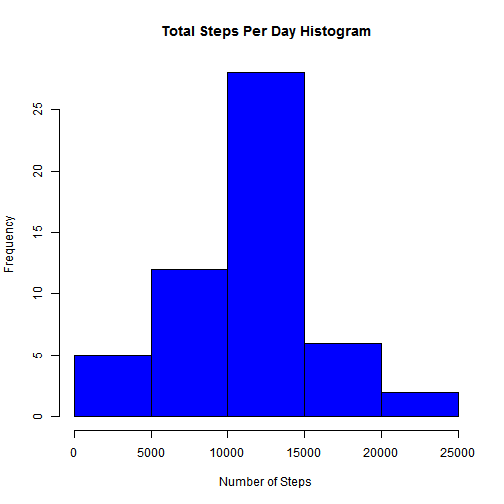
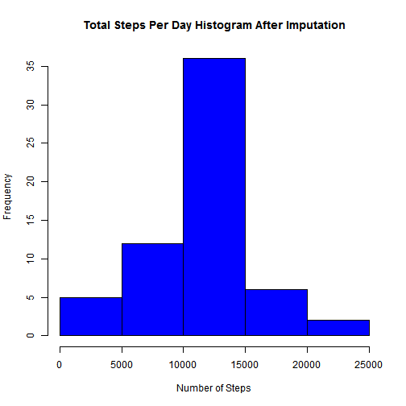

Reproducible Research: Peer Assessment 1
==============================================================

## Loading and preprocessing the data

```r
activity <- read.csv("activity.csv", stringsAsFactors = FALSE,
                     colClasses = c("numeric","Date","numeric"))
```


## What is mean total number of steps taken per day?

```r
# Load libraries, set working directory and remove scientific notation
library(sqldf, quietly = TRUE)
library(tcltk, quietly = TRUE)
setwd("C:\\Users\\Renato\\RepData_PeerAssessment1")
options(scipen = 999, digits = 8)

# Remove NA values
no_na_activity <- activity[is.na(activity$steps) == FALSE, ]

# Sum the steps per day using sqldf (could use aggregate too)
total_per_day <- sqldf("select date,sum(steps) from no_na_activity group by date")
colnames(total_per_day) <- c("Date","Steps")

# Plot the Histogram of total steps taken per day
hist(total_per_day$Steps, main = "Total Steps Per Day Histogram",
     xlab = "Number of Steps", col = "blue")
```



```r
# Calculate the mean and median of total steps taken per day
mean_steps <- round(mean(total_per_day$Steps))
median_steps <- median(total_per_day$Steps)
```

The mean of total steps taken per day is **10766**  
The median of total steps taken per day is **10765**


## What is the average daily activity pattern?

```r
# Calculate the mean grouped by intervals
avg_interval <- sqldf("select interval, avg(steps) from no_na_activity group by interval")

# Rename the Columns
colnames(avg_interval) <- c("Interval","Steps_Avarage")

# Line plot of the data 
plot(avg_interval$Interval, avg_interval$Steps_Avarage, type = "l",
     main = "Total Steps Taken (Avg) per 5 min Interval", xlab = "5 min Interval", 
     ylab = "Avarage Steps")
```


```r
# Max of median steps per day
max_min_interval <- avg_interval[avg_interval$Steps_Avarage == max(avg_interval$Steps_Avarage), "Interval"]
max_steps <- round(max(avg_interval$Steps_Avarage))
```
The maximum number of steps in the 5 min interval is **206**  
The 5-min interval that has the maxium steps is **835** 

## Imputing missing values

```r
# Calc the total number os NA's
tot_na <- sum(!complete.cases(activity))
```

The total NA values in the file is **2304**  

Input method used: The rounded mean of 5 min interval of all days

```r
# Input the values into NA
filled_activity <- activity
for (i in 1:nrow(activity)){
    if (complete.cases(activity[i,]) == FALSE){
        interval <- activity[i, "interval"]
        filled_activity[i,1] <- round(avg_interval[avg_interval$Interval == interval, "Steps_Avarage"])
    }
}

# Group the data by date
day_steps_input_na <- sqldf("select date,sum(steps) from filled_activity group by date")

# Rename the columns
colnames(day_steps_input_na) <- c("Date","Steps")

# Calc the mean and the median after input data
mean_input_na   <- round(mean(day_steps_input_na$Steps))
median_input_na <- median(day_steps_input_na$Steps)

# Calc the difference between means and medians
dif_mean <- mean_input_na - mean_steps
dif_median <- median_input_na - median_steps

# Plot the new histogram
hist(day_steps_input_na$Steps, main = "Total Steps Per Day Histogram After Imputation",
     xlab = "Number of Steps", col = "blue")
```



After the imputation of values:  
The mean now is: **10766**  
The median now is: **10762**  

The difference between the means, after the input and before the input, is: **0**  
The difference between the medians, after the input and before the input, is: **-3**


## Are there differences in activity patterns between weekdays and weekends?

```r
# Load lattice plot system
library(lattice, quietly = TRUE)

# Another df with weekdays
filled_activity$Week <- weekdays(filled_activity$date)

# Transform to put weekday or weekend
for (i in 1:nrow(filled_activity)){
    if (filled_activity[i,4] == "sábado" | filled_activity[i,4] == "domingo"){
        filled_activity[i,4] <- "weekend"
    } else{
        filled_activity[i,4] <- "weekday"
    }
}

# Transform to factor
filled_activity$Week <- as.factor(filled_activity$Week)

# Group by interval
filled_activity_group <- sqldf("select interval, avg(steps), Week from filled_activity group by interval, Week")

# Rename the columns
colnames(filled_activity_group) <- c("interval", "steps", "week")

# Plot the comparison
xyplot(steps ~ interval | week, data = filled_activity_group, type = "l",
       layout = c(1,2), xlab = "Interval", ylab = "Number of Steps", main = "Avarage Step Count on Weekdays vs Weekends")
```


